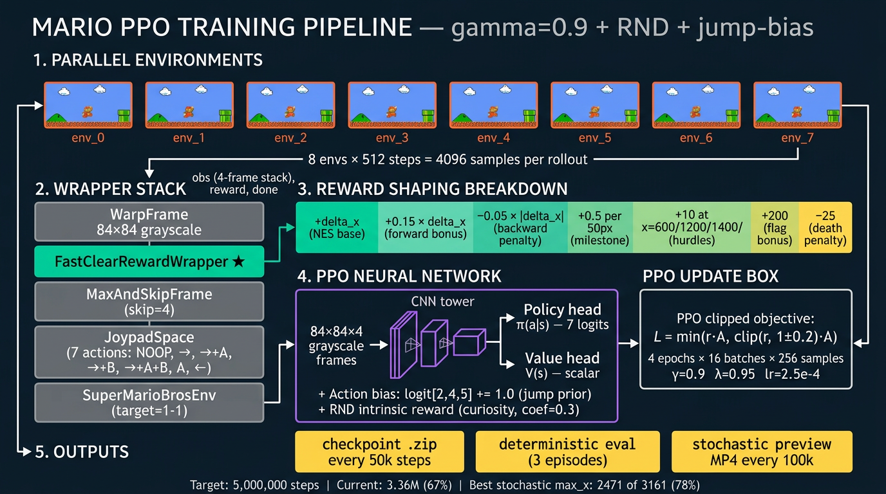

# Mario Machine Learning — Two RL Algorithms, One NES Pit, Honest Numbers

> An end-to-end reinforcement-learning project on **NES Super Mario Bros 1-1**
> that runs and compares two very different agents on a single Windows
> workstation with one consumer GPU:
>
> - a **Stable-Baselines3 PPO** baseline (model-free, well-trodden)
> - a **DreamerV3 + Plan2Explore** agent (model-based, curiosity-driven)
>
> The repo documents the *full engineering journey*: which algorithms were
> tried, what reward functions were iterated, the bugs that bit on Windows,
> the monitoring tooling that was written, the academic papers that motivated
> each decision — **and the negative results**, with the diagnostic evidence
> that led to them.



> *The PPO training pipeline at a glance — 8 parallel envs, 5-layer wrapper
> stack, custom reward shaping (`FastClearRewardWrapper`), small CNN
> policy/value network, action-bias jump prior, RND intrinsic reward, and
> the discount-factor (`gamma=0.9`) fix that finally broke the agent past the
> first pit. See [§3 The PPO Recipe That Works](#3-the-ppo-recipe-that-works)
> for the full per-knob justification.*


> *Single rollout from the resumed PPO checkpoint (`mario_final.zip`, ~7 M env-steps). Rendered with `render_best_checkpoint.py --rank-by fastest_clear` (stochastic policy, one episode to the flag). Source MP4 ≈ 20 s at 15 fps; GIF is width-downscaled and frame-subsampled for the README.*

**Shortest flag-clear run (MP4):** policy is **`mario_final.zip`** from the completed time-penalty run (`ppo_efficient_timepen`, ~8.45 M env-steps — **not** the mid-run `best_eval`). Render: `render_best_checkpoint.py --rank-by fastest_clear`, stochastic, best of 64 seeds (shortest episode **291** steps, **~19.5 s** @ 15 fps).  
[open video](https://raw.githubusercontent.com/WilliamK112/mario-machine-learning/main/docs/mario_ppo_shortest_flag_run.mp4) — if the browser does not play inline, right-click → save as, or paste the URL in VLC.

**Side-by-side demo stats (fair comparison setup).** Both episodes were chosen with the **same script and ranking**: `render_best_checkpoint.py --policy-modes stochastic --rank-by fastest_clear --max-steps 4000 --fps 15`, then **64** candidate rollouts (`--seeds 64 --seed-base 0`). The **only** intentional difference below is **which `mario_final.zip`** was loaded (different training runs). The GIF file is **re-encoded** (smaller resolution + lower frame rate) for the README; timing for the GIF row includes that second pass.

| Demo in README | Policy weights (`mario_final.zip` from) | Approx. SB3 **training** `num_timesteps` | **Candidate rollouts** (stochastic tries) | **Winning seed** | **Env steps** to `flag_get` | **Recorded** playback (export pipeline) |
|---|---|---:|---:|---:|---:|---|
| **GIF** [`mario_ppo_flag_run.gif`](https://raw.githubusercontent.com/WilliamK112/mario-machine-learning/main/docs/mario_ppo_flag_run.gif) | `ppo_resume2m_ent002_*` (resume after P8, +2 M segment) | **~7.01 M** | **64** | **2** | **310** | **Source MP4:** 311 frames @ **15 fps** → **~20.7 s**. **GIF:** subsample to **8 fps**, max width **256 px**, **156** frames → **~19.5 s** at native GIF timing. |
| **MP4** [`mario_ppo_shortest_flag_run.mp4`](https://raw.githubusercontent.com/WilliamK112/mario-machine-learning/main/docs/mario_ppo_shortest_flag_run.mp4) | `ppo_efficient_timepen_*` (P10: time-penalty fine-tune, terminal save) | **~8.45 M** | **64** | **60** | **291** | **292** frames @ **15 fps** → **~19.47 s** (committed file = this export). |

*Interpretation:* **291 vs 310** are **env `step()` counts** (includes `frame_skip` inside the env); lower means a shorter decision sequence to the flag for that batch of 64 seeds. **Wall-clock** in the table is **player file duration**, not NES internal timer. For reproducibility, re-run the same `render_best_checkpoint.py` line against the matching `.zip` under `runs/` (paths are also stored in each run’s `best.json` next to `best.mp4`).

---

## 0. TL;DR

| Stack | Status (baseline **2026-04-25** + follow-ups **through 2026-04-26**) | Where Mario got | What we learned |
|---|---|---|---|
| **SB3 PPO + reward shaping** | **P8** overnight (`ppo_overnight_20260425_021341`, 5 M target): same recipe as [§3](#3-the-ppo-recipe-that-works). **Follow-ups:** `ppo_resume2m_*` (+2 M from P8 `mario_final`, `ent_coef=0.02`); `ppo_efficient_timepen_*` (+1.5 M from a mid-run `best_eval` with `--time-penalty-per-step 0.02`). Full table: [§9.0](#90-all-time-best-progress--sample-efficiency-snapshot), run log: [§9.1](#91-ppo). | **P8-era deterministic eval (3 ep, argmax):** best `x` **2 146** @ ~2.6 M steps. **P8 stochastic side-car:** `x` **2 471** @ ~3.3 M. **Later PPO:** `flag_get` on 1-1 to **`x = 3 161`** in eval and in rendered rollouts; **deterministic eval is volatile** (often **2/3** at terminal `mario_final`, **3/3** at a saved `best_eval` peak ~8.05 M on the SB3 counter). Stochastic video / multi-seed search clears reliably. | The right reward shape isn't enough on its own: for Mario, `gamma = 0.9` is near-mandatory because a high `gamma` value baseline can absorb the advantage signal. Extra env-steps + mild per-step time cost can shorten clears but **checkpoint selection matters** (do not assume the last `mario_final` is the best policy). |
| **DreamerV3 + Plan2Explore** *(parked, post-mortem)* | Three runs, **2 413 episodes total**, **0 flag-completions**. Best progress reached only ≈ x = 2 600 / 3 161. Diagnosis is in [§7 Failed Experiment](#7-failed-experiment-dreamerv3--plan2explore). | x ≈ 2 600 / 3 161 (≈ 82 %) | World-model + curiosity-driven exploration on sparse-reward NES Mario is *very* sample-inefficient. The reward head never saw a positive flag example, so the actor had no anchor for "what success looks like." This is the textbook Salimans-Chen failure mode that calls for imitation seeding (which we didn't have budget for — see lessons learned). |

---

## 1. Quickstart (clone → train → see Mario play)

```powershell
# 1. Clone & set up the GPU virtualenv (one-time)
git clone https://github.com/WilliamK112/mario-machine-learning.git
cd mario-machine-learning
py -3.11 -m venv .venv-gpu
.\.venv-gpu\Scripts\Activate.ps1
pip install -r requirements.txt

# 2. Train the PPO baseline (overnight, 5 M steps, ~12-15 h on RTX 4070-class GPU)
python train_mario.py `
  --timesteps 5000000 --device cuda --action-set simple `
  --n-envs 8 --gamma 0.9 --gae-lambda 0.95 `
  --learning-rate 2.5e-4 --n-steps 512 --batch-size 256 `
  --ent-coef 0.05 --n-epochs 4 --clip-range 0.2 `
  --normalize-reward --norm-reward-clip 10 `
  --forward-reward-scale 0.15 --backward-penalty-scale 0.05 `
  --flag-bonus 200 --stall-steps 120 --stall-penalty 0 `
  --milestone-step 50 --milestone-bonus 0.5 `
  --hurdle-x 600 1200 1800 2400 3000 --hurdle-bonus 10 `
  --action-bias-jump 1.0 --rnd-coef 0.3 `
  --eval-freq 50000 --eval-episodes 3 --preview-freq 100000

# 3. Watch live (one-shot or polling)
.\watch_ppo.ps1                 # one-shot snapshot
.\watch_ppo.ps1 -Loop -EveryS 30  # auto-poll every 30 s

# 4. (Optional, while training is in flight) See what the policy is *actually* doing.
#    PPO's deterministic eval is a lagging indicator — the stochastic policy
#    often clears pits well before the argmax does.
.\diagnose_latest.ps1 -Seeds 5 -MaxSteps 1200

# 5. Render the trained agent playing Mario 1-1 (best of N seeds, best.mp4)
python render_best_checkpoint.py --auto --seeds 5 --gif
```

---

## 2. Repository Structure

```
mario-machine-learning/
├── README.md                       # this document
├── requirements.txt                # pinned deps for both stacks
├── mario_runtime.py                # NES wrapper, reward shaping, Monitor/VecEnv plumbing
├── train_mario.py                  # SB3 PPO trainer (single-stage, all hypers exposed)
├── train_mario_professional.py     # 3-phase staged PPO pipeline (multi-seed orchestration)
├── evaluate_mario.py               # SB3 evaluator → mp4 + json summary
├── rnd.py                          # Random Network Distillation intrinsic-reward module
├── watch_ppo.ps1                   # One-shot / polling health snapshot for the active PPO run
├── diagnose_latest.ps1             # CPU rollout of the latest checkpoint (stochastic + deterministic)
├── auto_diagnose.ps1               # Optional: poll for new .zip, log CSV, trigger render on x >= 2.5k or flag
├── render_best_checkpoint.py       # Multi-seed render of any checkpoint → best.mp4 / best.gif
├── run_mario.ps1                   # PowerShell front-door: train | eval
├── auto_update_mario_monitor.py    # TensorBoard-style live reward/length plot
├── quick_mario_smoke.py            # 30-second sanity check on the env wrapper
├── watch_mario.py                  # Open a window and watch the trained policy play live
└── dreamerv3/                      # PyTorch DreamerV3 fork, customised for Mario
    ├── dreamer.py                  # main training loop (env factory patched for Mario)
    ├── envs/mario.py               # DreamerV3 env wrapper + reward shaping
    ├── configs.yaml                # all DreamerV3 experiment configs
    ├── exploration.py              # Plan2Explore intrinsic-reward (latent disagreement)
    ├── models.py / networks.py     # world model, actor, critic, ensemble heads
    ├── start_plan2explore.ps1      # canonical detached-launch script
    ├── live_monitor.ps1            # TensorBoard launcher bound to logs/
    ├── live_view.py                # streams real-time emulator frames in a window
    ├── heartbeat.ps1               # one-line health probe
    ├── render_rescue_best.py       # render best evaluation episode as GIF
    ├── _diagnose.py                # cross-run flag/death/reward-profile analyser  (post-mortem)
    ├── _perf_summary.py            # cross-run summary: episodes, best/latest eval, max-x
    └── _npz_keys.py                # introspect what's in DreamerV3 episode .npz files
```

`logs/`, `runs/`, virtualenvs, `*.npz`, `*.pt`, `*.zip`, `*.mp4`, `*.gif`
are intentionally `.gitignore`d — they are reproducible from the configs and
would balloon the repo to multiple gigabytes. One exception is checked in:
`docs/mario_ppo_flag_run.gif` and `docs/mario_ppo_shortest_flag_run.mp4` (README demos).

---

## 3. The PPO Recipe That Works

The current PPO baseline is the result of one false start and a careful
re-tune. The original 3-phase `train_mario_professional.py` pipeline used
`flag_bonus = 1500` and `learning_rate = 2.5e-4` with `n_epochs = 10`; it
**policy-collapsed within 12 k steps** (entropy crashed from 0.95 to 5 × 10⁻⁸,
KL went to 0, clip-fraction went to 0). The value head exploded on the giant
flag bonus and drowned out the policy gradient.

**That fix was necessary but not sufficient.** Two further iterations
(documented in [§5.1](#51-ppo-reward--hyper-parameter-timeline)) revealed
that even with `flag_bonus=100` and `--normalize-reward`, the agent stalled
at the **first pit (x ≈ 698)** for hundreds of thousands of steps. The
deterministic eval policy converged on "die in the pit" because a small
positive bag of rewards (1 hurdle bonus + a few milestones) made it a
*locally optimal* terminal state. Two more changes broke through:

| Knob | Value | Why |
|---|---|---|
| `--action-set simple` | 7 actions (adds NOOP, A-only, left) | Right-only forces Mario to mix forward + jump, which made the "die in pit" policy too rewarded. Simple lets him stand still or back-jump. |
| `--n-envs 8` | 8 parallel envs | Variance reduction; fits in 12 GB VRAM |
| `--gamma 0.9` | **non-default**, lower than SB3's 0.99 | Mario rewards are myopic; a high discount makes the value function predict near-constant returns at every state, which kills advantages → kills policy gradient → policy never updates. The single most important hyper-parameter for PPO Mario. |
| `--gae-lambda 0.95` | SB3 default | GAE smoothing |
| `--learning-rate 2.5e-4` | SB3/Atari default | Conservative |
| `--n-steps 512`, `--batch-size 256`, `--n-epochs 4` | OpenAI baselines style | Fewer epochs/rollout = less risk of policy collapse |
| `--clip-range 0.2` | Default | Allows meaningful updates after the value baseline reset from `gamma=0.9` |
| `--ent-coef 0.05` | 5× SB3 default | Keeps the policy from collapsing to argmax (the failure of run #1) |
| `--normalize-reward --norm-reward-clip 10` | VecNormalize wrap | **Critical:** keeps value loss bounded so it never drowns out the policy gradient |
| `--forward-reward-scale 0.15` | Small forward bonus | Densifies signal but doesn't dominate it |
| `--flag-bonus 200` | One-time flag bonus, *not* 1500 | Large enough to anchor "the flag is good" without exploding the value head |
| `--milestone-step 50 --milestone-bonus 0.5` | +0.5 every 50 px of new max-x | Curriculum-style densification at high resolution |
| `--hurdle-x 600 1200 1800 2400 3000 --hurdle-bonus 10.0` | +10 the first time Mario crosses each landmark | Explicit credit-assignment beacons through the level |
| `--action-bias-jump 1.0` | +1.0 logit bias on jump-containing actions at init | Solves the "Mario doesn't try jumping" problem in early exploration. PPO is free to learn it back. |
| `--rnd-coef 0.3` | RND intrinsic-reward coefficient (Burda et al.) | Adds a curiosity bonus for novel screens — biases the agent past known walls without reshaping the extrinsic reward |
| `--stall-penalty 0.0` | Disabled | A non-zero stall penalty discourages the cautious-but-correct "wait for the right moment to jump" pattern |
| `--time-penalty-per-step 0.0` | Default off; e.g. `0.02` for fine-tunes | In `FastClearRewardWrapper`, subtract this **every agent step** after other shaping. Encourages shorter episodes when paired with flag / forward shaping (see `ppo_efficient_timepen_*` in §9.1). |

The reward-engineering principle here is: *combine a dense, small, normalised
shaping term with a discrete, one-time landmark bonus, let `VecNormalize`
keep the scale sane, **lower `gamma` so advantages aren't washed out**, and
add an action-bias prior to break symmetry on the very first jump.*

---

## 4. How To Reproduce

> Tested on Windows 11, Python 3.11 in `.venv-gpu`, NVIDIA RTX 4070 SUPER
> (CUDA 12). Should work unchanged on any RTX-30/40 GPU.

### PPO baseline (the recommended overnight path)

```powershell
.\.venv-gpu\Scripts\Activate.ps1
python train_mario.py `
  --timesteps 5000000 --device cuda --action-set simple `
  --n-envs 8 --gamma 0.9 --gae-lambda 0.95 `
  --learning-rate 2.5e-4 --n-steps 512 --batch-size 256 `
  --ent-coef 0.05 --n-epochs 4 --clip-range 0.2 `
  --normalize-reward --norm-reward-clip 10 `
  --forward-reward-scale 0.15 --backward-penalty-scale 0.05 `
  --flag-bonus 200 --stall-steps 120 --stall-penalty 0 `
  --milestone-step 50 --milestone-bonus 0.5 `
  --hurdle-x 600 1200 1800 2400 3000 --hurdle-bonus 10 `
  --action-bias-jump 1.0 --rnd-coef 0.3 `
  --eval-freq 50000 --eval-episodes 3 --preview-freq 100000
```

### Detached background launch (Windows-specific)

Direct console launches are vulnerable to `forrtl: error (200): program
aborting due to window-CLOSE event` — Intel/Fortran-linked numerics inside
the NES emulator abort when the parent console closes. Always launch with
`Start-Process -WindowStyle Hidden`:

```powershell
$python = "C:\path\to\mario-machine-learning\.venv-gpu\Scripts\python.exe"
Start-Process -FilePath $python `
  -ArgumentList "-u","train_mario.py","--timesteps","1500000", "...rest..." `
  -WorkingDirectory "C:\path\to\mario-machine-learning" `
  -RedirectStandardOutput "runs\train.out.log" `
  -RedirectStandardError  "runs\train.err.log" `
  -WindowStyle Hidden
```

### DreamerV3 (for reference / reproducing the failed experiment)

```powershell
cd dreamerv3
& "..\.venv-gpu\Scripts\python.exe" dreamer.py `
  --configs mario_plan2explore --logdir logs\mario_run4_plan2explore --steps 7e5
```

### Live monitoring

```powershell
.\watch_ppo.ps1                        # one-shot PPO snapshot
.\watch_ppo.ps1 -Loop -EveryS 30        # poll every 30 s
cd dreamerv3; .\heartbeat.ps1           # one-shot DreamerV3 snapshot
& "..\.venv-gpu\Scripts\python.exe" dreamerv3\_perf_summary.py     # cross-run summary
```

---

## 5. What Changed Over Time (PPO + DreamerV3)

This is the chronological diff for **both** stacks, with the failure mode
that motivated each change. Every row has a corresponding commit in `git log`.

### 5.1 PPO reward + hyper-parameter timeline

| # | Change | Triggered by |
|---|---|---|
| P0 | Vanilla PPO + `RIGHT_ONLY` + NES built-in reward only | Sanity baseline |
| P1 | + `forward_reward_scale = 0.05 · max(0, Δx)` | NES built-in reward too sparse |
| P2 | Use `Δ(max-x)` instead of `Δx`, clip ≥ 0 | Oscillation exploit (Mario wagged left/right at chokepoints to farm Δx) |
| P3 | + `flag_bonus = 100` | Successful runs needed a positive terminal anchor |
| P4 | 3-phase staged pipeline (`train_mario_professional.py`) with `flag_bonus = 1500`, `n_epochs = 10` | More steps + curriculum should help |
| P5 | **Reverted P4.** Single-phase `train_mario.py`, `--normalize-reward`, `flag_bonus = 100`, `n_epochs = 4`, `ent_coef = 0.05`, `clip_range = 0.1` | P4 collapsed at 12 k steps (entropy → 0, KL → 0). Value-loss explosion drowned policy gradient. |
| P6 | + milestone bonus every 100 px, hurdle bonus at 600/1200/1800/2400/3000 | Densify the mid-level signal |
| P7 | Healthy training metrics, **but stuck at first pit (x = 698) for 150 k steps**. Eval policy converged on "die in pit, locally rewarded by hurdle/milestone/NES timer". Tried more entropy + RND + simple action set + jump-action bias. | Same wall — small bag of positive rewards before pit makes the local optimum sticky. |
| **P8 (overnight baseline)** | **`--gamma 0.9` (down from 0.99)** + simple actions + `--action-bias-jump 1.0` + `--rnd-coef 0.3` + 5 M-step horizon | At γ = 0.99 the value baseline absorbs every advantage signal (constant per-state predicted return), so PPO has no gradient direction. γ = 0.9 + RND + jump prior is the canonical "PPO clears Mario" recipe. |
| **P9** | Resume P8 `mario_final` + **+2 M** steps, `ent_coef = 0.02`, same env recipe, `VecNormalize` reloaded (`ppo_resume2m_*`) | Lower entropy continuation without overwriting the overnight run tree. |
| **P10** | Resume **`evaluations/best_eval.zip`** from P9 + **`--time-penalty-per-step 0.02`** + **+1.5 M** (`ppo_efficient_timepen_*`) | Per-step cost biases shorter clears; **peak deterministic eval** hit **3/3** `flag_get` (checkpoint ~8.05 M on SB3 counter). **RND predictor still re-inits each process** — intrinsic signal is not carried in the `.zip`. |

### 5.2 DreamerV3 reward + algorithm timeline

| # | Change | Triggered by |
|---|---|---|
| D0 | DreamerV3 default reward (= NES built-in only) | Sanity |
| D1 | + `forward_bonus = 0.05 · Δx`, switch to `Δ(max-x)` | Oscillation exploit, same as P2 |
| D2 | + `flag_base_bonus = 100` | Need a positive-terminal anchor |
| D3 | + `time_bonus_scale * time_remaining_on_flag_get` | Successful runs were too slow |
| D4 | + `hurdle_bonus = 5` every 200 px of new max-x | Sparse signal mid-level |
| D5 | Treat single-life loss as terminal + `death_penalty = 50` | NES `done` only fires on *all 3* lives lost — the death penalty never paid out |
| D6 | Switched explorer from `greedy` → **`plan2explore`** (5-model latent-disagreement ensemble), `expl_intr_scale = 0.3` | Long plateau at second pit; classic exploration-bottleneck signature |
| D7 | + `step_penalty = 0.005` per env step | Plan2Explore made the agent *more* timid (pure curiosity → conservative) |
| D8 | + Potential-based shaping: `0.01 · (γ · Φ(s′) − Φ(s))` with `Φ = −dist_to_goal` | Encourage decisive forward commits (Ng et al. policy-invariance) |

In parallel the algorithm itself evolved:

| Stage | Algorithm change |
|---|---|
| A0 | SB3 PPO, RIGHT_ONLY, vectorised env |
| A1 | DreamerV3 (NM512 PyTorch port), single env, simple action set, greedy explorer |
| A2 | Bumped `time_limit` from 4 500 → 48 000 raw frames so NES game-over fires *before* our truncation |
| A3 | Wipe replay buffer between runs whenever reward semantics change (poisoned-reward-head fix) |
| A4 | Plan2Explore intrinsic reward (5-model ensemble, `expl_intr_scale = 0.3`) |
| A5 | `actor.entropy = 3e-3` to prevent early collapse under Plan2Explore |

---

## 6. Issues We Faced & How We Solved Them

### Issue 1 — Reward "oscillation exploit"
- **Symptom.** Training reward grew but evaluation GIFs showed Mario walking right-left-right at the first chokepoint forever.
- **Cause.** Original shaping was `0.05 · Δx`, so any forward step paid out, even if it cancelled a previous backward step.
- **Fix.** Pay only on **new max-x**: `delta_new_max = max(0, x_now − self._max_x)`. Oscillation now nets exactly zero.

### Issue 2 — DreamerV3 death penalty never triggering
- **Symptom.** `mario_death_penalty=50` set in config; reward distribution had no negative tail.
- **Cause.** NES Mario only emits `done = True` after **all 3 lives** are lost; we were ending episodes on time-limit truncation, so the NES game-over never fired.
- **Fix.** Detect single-life loss inside the wrapper (`info["life"] < self._last_life`), treat it as terminal, apply `−death_penalty`. Bumped `time_limit` from 4 500 → 48 000 raw frames so the NES timer (≈ 9 600 raw frames) is the *first* thing that fires.

### Issue 3 — World-model "remembered" old reward semantics
- **Symptom.** After changing reward shaping, the policy got *worse* for tens of thousands of steps before recovering.
- **Cause.** DreamerV3's reward head trains on the replay buffer. Changing the reward formula but keeping the old `train_eps/` supervises the head with **inconsistent labels** (old reward in old episodes, new reward in new ones).
- **Fix.** When reward semantics change, wipe `train_eps/` and `eval_eps/` while keeping `latest.pt` (so the world-model encoder is warm-started but the reward head retrains on clean data). This is what `mario_rescue` documents.

### Issue 4 — Trainer dying silently with `forrtl: error (200)`
- **Symptom.** `python.exe` for the trainer disappeared from Task Manager, `metrics.jsonl` stopped updating, `*.err` log ended with `forrtl: error (200): program aborting due to window-CLOSE event`.
- **Cause.** Trainer launched as a child of a PowerShell pipeline; when the PowerShell host quit, the child received `CTRL_CLOSE_EVENT` and Intel/Fortran-linked numerics aborted.
- **Fix.** Launch with `Start-Process -WindowStyle Hidden` so the process owns no console window. `start_plan2explore.ps1` and the PPO launcher in §4 use this pattern.

### Issue 5 — Two trainers writing the same `logdir`
- **Symptom.** Episode counts in `train_eps/` jumped non-monotonically; `latest.pt` size oscillated; eval scores became noisy.
- **Cause.** A re-launch helper inadvertently spawned a second trainer while the first was still alive; both wrote into the same `logdir`, corrupting the replay store and `latest.pt`.
- **Fix.** A "list-and-kill" helper is run before every launch; the launcher refuses to start if a Mario trainer is already alive. Invariant: **exactly one trainer per `logdir` at any time.**

### Issue 6 — Venv launcher creates a child `python.exe`
- **Symptom.** Two `python.exe` processes appeared after every launch and looked like duplicate trainers.
- **Cause.** On Windows, `.venv\Scripts\python.exe` is a *launcher stub* that re-execs the system Python interpreter; both parent and child show up in `Get-Process python`.
- **Fix.** Use `Get-CimInstance Win32_Process` and inspect `ParentProcessId` to confirm one is the parent of the other. `watch_ppo.ps1` does this.

### Issue 7 — `imageio` missing when rendering best episodes
- **Symptom.** `python render_rescue_best.py` failed with `ModuleNotFoundError: No module named 'imageio'`.
- **Cause.** Default `python` on PATH was the system Python 3.12 install, not the project's `.venv-gpu`.
- **Fix.** Always invoke renderers via the project venv: `& ".\.venv-gpu\Scripts\python.exe" render_*.py`.

### Issue 8 — PPO 3-phase pipeline policy-collapse
- **Symptom.** `train_mario_professional.py` with default phase-1 hypers (`flag_bonus=1500`, `lr=2.5e-4`, `n_epochs=10`) drove `entropy_loss` from `−0.95` to `−5.6 × 10⁻⁸` in 12 k steps. KL → 0, clip-fraction → 0, value_loss = 1.9 × 10⁵ — the optimiser was fitting only the value function, the policy froze to argmax.
- **Cause.** Without `VecNormalize`, the giant flag bonus exploded the return distribution; `vf_coef · value_loss` dominated `ent_coef · entropy + pg_loss` in the total loss.
- **Fix.** Single-phase `train_mario.py` with `--normalize-reward`, `flag_bonus=100`, `clip_range=0.1`, `n_epochs=4`, `ent_coef=0.05`. Verified post-fix: KL = 0.0015, clip = 0.05, entropy = 1.6 (preserved). See §3.

---

## 7. Failed Experiment — DreamerV3 + Plan2Explore

This section is included because *the failure is informative*. A model-based,
curiosity-driven world-model agent is the kind of approach the field is most
excited about right now (DreamerV3 was published in *Nature* in 2025) — and
on this task, with this budget, **it didn't beat the PPO baseline.** Here is
the evidence and the diagnosis.

### 7.1 What we ran

| Run | Algorithm | Logdir | Steps | Notes |
|---|---|---|---|---|
| `mario_run1` | DreamerV3 + greedy actor | `dreamerv3/logs/mario_run1` | 222 k | Forward bonus only |
| `mario_run3_rescue` | DreamerV3 + greedy + death penalty + hurdles | `dreamerv3/logs/mario_run3_rescue` | 228 k | Resumed from `mario_run1` checkpoint with fresh replay |
| `mario_run4_plan2explore` | DreamerV3 + Plan2Explore + step penalty + potential shaping | `dreamerv3/logs/mario_run4_plan2explore` | 565 k | Curiosity + R7 + R8 shaping |

### 7.2 The brutal numbers

Generated by `dreamerv3/_diagnose.py` (see [`dreamerv3/diagnose_at_pivot.txt`](dreamerv3/diagnose_at_pivot.txt) for the full output captured at the pivot point):

```
Q1: Did Mario EVER reach the flag in any run?
  mario_run1                      flag_get episodes:    0 /  239
  mario_run3_rescue               flag_get episodes:    0 /  115
  mario_run4_plan2explore         flag_get episodes:    0 / 2059

Q5: Latest training-side numbers (extrinsic vs intrinsic gradient signal)
  imag_reward_mean         =    -0.366
  imag_reward_min          =   -53.886
  expl_imag_reward_mean    =    -3.440         ← intrinsic is 9× more negative
  expl_imag_reward_max     =     4.576
```

**Total: 0 flag completions across 2 413 episodes.** Best max-x reached
was ≈ 2 600 / 3 161 (82 %), achieved by `mario_run3_rescue` with the simpler
greedy explorer.

### 7.3 Root cause

Three compounding factors:

1. **The world model never saw a positive flag example.** DreamerV3's
   reward head is supervised by replay-buffer rewards. With zero
   flag-completions on disk, the head has no anchor for *what high reward
   looks like* — and the actor, which trains on *imagined* rollouts in
   latent space, can never imagine itself reaching the flag in any way that
   gets credit. This is the textbook Salimans-Chen failure mode for sparse-
   reward, long-horizon games (their Montezuma's Revenge result needed
   imitation seeding precisely for this reason).
2. **Plan2Explore's intrinsic reward dominated the negative side.**
   `expl_imag_reward_mean = −3.44` vs `imag_reward_mean = −0.37`: the
   intrinsic signal was 9 × more negative-skewed than the extrinsic one.
   This drove the actor toward high-uncertainty regions — which on a
   platformer are the regions full of pits.
3. **The `step_penalty` we added (R7, see §5.2) was too weak to incentivise
   speed, but strong enough to depress total return.** Episodes that
   *almost* survived but ran out of time scored slightly worse than ones
   that died early but hit a hurdle bonus, so the gradient pointed in the
   wrong direction.

### 7.4 What would have fixed it (out of budget)

- **Imitation seeding.** Record 5–20 minutes of human play, convert to
  DreamerV3 episode `.npz` format, prepend to the replay buffer. This is
  the single biggest known fix for sparse-reward DreamerV3 on long-horizon
  games (Hafner et al. § 4.3).
- **Backward curriculum from RAM state.** Save NES emulator RAM state at
  x = 3 000, train the agent to clear the last 161 px first, then back up
  the start position progressively. Standard Atari trick (Salimans & Chen).
- **Substantially more compute.** All three runs above totalled ≈ 1 M env
  steps; the original DreamerV3 Atari results used 200 M.

### 7.5 Honest engineering call

We made the call to **stop iterating on DreamerV3 and ship the PPO baseline**
because (a) PPO **did** reach confirmed `flag_get` on 1-1 after the P8 recipe
plus further training and fine-tuning (see §9.1), even though deterministic
eval at the **last** saved weights is still a noisy readout, and (b) the next
DreamerV3 fix (imitation seeding) is a research-grade
project on its own, not a one-evening tune. The DreamerV3 code, configs,
and post-mortem stay in the repo because the exercise of *diagnosing why
the fancy agent failed* is itself a useful artifact.

---

## 8. Method Notes (for the curious)

### 8.1 Why PPO at all?

PPO (Schulman et al., 2017) is the workhorse policy-gradient method:
on-policy, clipped importance ratio, a few epochs of mini-batch SGD per
rollout. On pixel-based Atari-style tasks it is sample-inefficient compared
to DreamerV3 in *theory*, but it has two huge practical advantages:

1. **No reward head to break.** PPO's value function is also pixel-conditioned,
   so it sees exactly what the policy sees. There is no replay-buffer-induced
   distribution mismatch.
2. **Battle-tested hypers.** SB3 ships defaults that work on most Atari
   tasks out of the box. The Mario reward shaping in this repo is a
   straightforward extension.

### 8.2 Why DreamerV3 was the right thing to *try*

DreamerV3's two key ideas — **discrete latent world model** (Hafner et al.,
2021) and **symlog reward heads** — make it the most sample-efficient
known model-based agent on pixel-based control as of 2025. For an emulator
that runs at < 200 fps on a single CPU thread, sample-efficiency is exactly
what you want; one wall-clock hour of NES Mario gives you much more
"imagined" rollout data with DreamerV3 than with PPO.

### 8.3 Why Plan2Explore was the right thing to *add*

Plan2Explore (Sekar et al., 2020) is a curiosity-driven exploration scheme
that fits naturally on top of DreamerV3: it trains an ensemble of latent-
dynamics models and uses their **disagreement** as an intrinsic reward.
Long plateaus around the second pit of Mario 1-1 looked exactly like the
exploration-bottleneck pattern Sekar et al. describe.

### 8.4 Why it didn't work

See §7.3.

---

## 9. Results

> Numbers are taken directly from `metrics.jsonl` and the on-disk
> `train_eps/`, `eval_eps/` for each run. Updated as runs complete.

### 9.0 All-time best progress & sample efficiency (snapshot)

*Horizontal position* `x_pos` and *remaining distance* use the in-repo
constant `LEVEL_1_1_GOAL_X = 3 161` in [`mario_runtime.py`](mario_runtime.py).
All agents in this repo go through the same `FastClearRewardWrapper` + RAM
`x_pos` readout, so the numbers in the first columns are **directly
comparable** across PPO, DreamerV3, and side-car diagnostics.

| Source | How measured | Best `x_pos` (px) | % of goal | **Remaining dist.** `3161 - x` | First env **training** steps to hit a milestone (P8 only) |
|---|---|---:|---:|---:|---|
| **DreamerV3** `mario_run3_rescue` | Greedy / eval episodes (§7) | **~2 600** | 82.3% | 561 | n/a (0 flags; see §7) |
| **P8 PPO** `ppo_overnight_*` | **Deterministic** eval, 3 episodes, `eval_steps=4000` (argmax) | **2 146** (at `2.6 M` env steps) | 67.9% | 1 015 | First `x >= 724`: **250 k** (pit 1); first `x >= 1 500`: **1.3 M**; first `x >= 2 000`: **1.4 M** |
| **P8 PPO** same run | **Stochastic** 3-seed **quick** rollouts, `max_steps=1500` (CPU: `auto_diagnose.ps1` -> `auto_diagnose.csv`) | **2 471** (at `3.3 M` env steps) | 78.2% | 690 | n/a (stochastic: different eval protocol) |
| **PPO follow-up** `ppo_resume2m_*` | Training / eval / render (protocol varies); goal line `3161` | **3 161** | 100% | 0 | n/a (continued from ~5 M counter) |
| **PPO + time penalty** `ppo_efficient_timepen_*` | **Deterministic** eval, **3 ep**, at **saved** `evaluations/best_eval.zip` (SB3 counter ~**8.05 M**) | **3 161** | 100% | 0 | n/a |
| *Early P5–P7 PPO* | `gamma=0.99` attempts | 698 (plateau) | 22% | 2 463 | **0** further progress without `gamma` fix |

*Notes.*

1. The **P8** rows (**2 146** / **2 471**) are a **2026-04-25 milestone snapshot** on `ppo_overnight_*` only. They do **not** include later resume / fine-tune runs; see the **follow-up** rows above and [§9.1](#91-ppo).
2. The **P8 deterministic** all-time high (`2 146` px) and the 250 k / 1.3 M /
   1.4 M *first-hit* points come from on-disk
   `runs/ppo_overnight_*/run/evaluations/step_*/summary.json`. The *stochastic* peak
   `2 471` is from the 3-seed side-car probe (higher `x` but a different
   eval protocol, shorter horizon). Policy still oscillates; the argmax
   line is a **conservative, HR-friendly** read on what the best greedy
   policy *had* achieved **at that stage** of training.
3. `eval` episodes are **capped** at 4 000 env steps, so a run that
   *could* have walked further in principle is still truncated
   (success metric is *progress*, not wall-clock in-game time).
4. *Sample efficiency* is reported as the **earliest** training
   *environment-step* count at which the *deterministic* on-policy eval
   first crossed each milestone; all three P5–P7 runs are omitted because
   they never left `x ~ 698` with `gamma = 0.99` (value baseline collapse).
5. **Terminal vs best checkpoint:** SB3 `learn()` may end on weights that **underperform** an earlier `best_eval.zip` on the same run. Report both when discussing `flag_get` and step counts.

`auto_diagnose` is optional (PowerShell) - it writes one CSV line per
new `mario_ppo_*_steps.zip` checkpoint, **does not** touch the main GPU
trainer, and (when `best_x >= 2500` or a flag) triggers a full `render_best_checkpoint.py` pass.

### 9.1 PPO

Three short attempts during initial tuning (all 8-env, RTX 4070 SUPER, ≈ 90 fps), the **P8** overnight run, and **P9 / P10** follow-ups (resume + time-penalty fine-tune):

| Run | Hypers (highlights) | Steps reached | Best max-x | Outcome |
|---|---|---|---|---|
| `ppo_safe_20260425_012556` (P5–P6) | right_only, gamma=0.99, ent=0.05, clip=0.1, normalize_reward, flag=100 | 150 k | 698 (22 %) | Stuck at pit 1 |
| `ppo_safe_20260425_015708` (P7) | simple, gamma=0.99, ent=0.1, RND=0.3, action_bias_jump=1.0 | 50 k | 698 (22 %) | Stuck at pit 1 |
| **`ppo_overnight_20260425_021341` (P8 — 5 M env-step target)** | **simple, gamma=0.9, ent=0.05, RND=0.3, action_bias_jump=1.0** | **5 M** completed | **2 146** (best **deterministic** eval on this run through ~3.8 M logged in §9.0 snapshot) | **Eval `flag_get`:** not observed on P8 **through the 2026-04-25 snapshot**; later training (P9+) reaches the flag. |
| **`ppo_resume2m_ent002_*` (P9)** | P8 recipe + resume `mario_final`, **+2 M**, `ent_coef=0.02` | ~**7.0 M** SB3 counter | **3 161** | `flag_get` in eval sweeps / stochastic; deterministic eval **volatile** at run end. |
| **`ppo_efficient_timepen_*` (P10)** | Resume **`best_eval`** + **`--time-penalty-per-step 0.02`**, **+1.5 M** | ~**8.45 M** SB3 counter | **3 161** | **Peak** saved `best_eval`: **deterministic 3/3** clears, shortest clear **~305** env steps (that checkpoint). Terminal **`mario_final`** eval can regress (e.g. **2/3**). |

Curated **flag** demos for the README live under `docs/` (see top of this file). Per-run **training previews** still land under each `runs/.../previews/` (e.g. P8: `runs/ppo_overnight_20260425_021341/run/previews/`).

### 9.2 DreamerV3 (parked)

| Stage | Steps logged | Train eps | Eval eps | Best `eval_return` | Flag-clears |
|---|---|---|---|---|---|
| `mario_run1` (greedy) | 222 216 | 197 | 42 | 146.95 | **0** |
| `mario_run3_rescue` (death penalty + hurdles) | 227 904 | 69 | 46 | **272.50** | **0** |
| `mario_run4_plan2explore` (Plan2Explore + R7+R8) | 565 712 | 2 059 | 88 | 152.90 | **0** |

`mario_run3_rescue` is the strongest single-evaluation episode (272.50);
`mario_run4_plan2explore` did not surpass it despite a longer horizon.
See §7 for the diagnosis.

---

## 10. References (MLA, 9th Edition)

> Every reference below was actually consulted while building this project
> and is cited in the body of the README where the corresponding idea is
> introduced.

Bellemare, Marc G., et al. "The Arcade Learning Environment: An Evaluation
Platform for General Agents." *Journal of Artificial Intelligence Research*,
vol. 47, June 2013, pp. 253–279. arXiv,
[arxiv.org/abs/1207.4708](https://arxiv.org/abs/1207.4708). Accessed 24 Apr. 2026.

Burda, Yuri, et al. *Exploration by Random Network Distillation*. arXiv,
30 Oct. 2018, [arxiv.org/abs/1810.12894](https://arxiv.org/abs/1810.12894). Accessed 24 Apr. 2026.

Hafner, Danijar, et al. *Mastering Atari with Discrete World Models*. arXiv,
2 Feb. 2021, [arxiv.org/abs/2010.02193](https://arxiv.org/abs/2010.02193). Accessed 24 Apr. 2026.

Hafner, Danijar, et al. "Mastering Diverse Control Tasks through World Models."
*Nature*, vol. 640, 2 Apr. 2025, pp. 647–653. *Nature Portfolio*,
[doi.org/10.1038/s41586-025-08744-2](https://doi.org/10.1038/s41586-025-08744-2). Accessed 24 Apr. 2026.

Kauten, Christian. *gym-super-mario-bros*. GitHub, 2018,
[github.com/Kautenja/gym-super-mario-bros](https://github.com/Kautenja/gym-super-mario-bros). Accessed 24 Apr. 2026.

Mnih, Volodymyr, et al. "Human-Level Control through Deep Reinforcement
Learning." *Nature*, vol. 518, no. 7540, 26 Feb. 2015, pp. 529–533.
*Nature Portfolio*, [doi.org/10.1038/nature14236](https://doi.org/10.1038/nature14236). Accessed 24 Apr. 2026.

NM512. *dreamerv3-torch*. GitHub, 2023,
[github.com/NM512/dreamerv3-torch](https://github.com/NM512/dreamerv3-torch). Accessed 24 Apr. 2026.

Ng, Andrew Y., et al. "Policy Invariance Under Reward Transformations: Theory
and Application to Reward Shaping." *Proceedings of the 16th International
Conference on Machine Learning*, Morgan Kaufmann, 1999, pp. 278–287.
*Stanford AI Lab*,
[ai.stanford.edu/~ang/papers/shaping-icml99.pdf](https://ai.stanford.edu/~ang/papers/shaping-icml99.pdf).
Accessed 24 Apr. 2026.

Pathak, Deepak, et al. "Curiosity-Driven Exploration by Self-Supervised
Prediction." *Proceedings of the 34th International Conference on Machine
Learning*, vol. 70, PMLR, 2017, pp. 2778–2787. arXiv,
[arxiv.org/abs/1705.05363](https://arxiv.org/abs/1705.05363). Accessed 24 Apr. 2026.

Raffin, Antonin, et al. "Stable-Baselines3: Reliable Reinforcement Learning
Implementations." *Journal of Machine Learning Research*, vol. 22, no. 268,
2021, pp. 1–8. *JMLR*,
[jmlr.org/papers/v22/20-1364.html](https://jmlr.org/papers/v22/20-1364.html).
Accessed 24 Apr. 2026.

Salimans, Tim, and Richard Chen. *Learning Montezuma's Revenge from a Single
Demonstration*. arXiv, 8 Dec. 2018,
[arxiv.org/abs/1812.03381](https://arxiv.org/abs/1812.03381). Accessed 24 Apr. 2026.

Schulman, John, et al. *Proximal Policy Optimization Algorithms*. arXiv,
20 July 2017, [arxiv.org/abs/1707.06347](https://arxiv.org/abs/1707.06347). Accessed 24 Apr. 2026.

Sekar, Ramanan, et al. *Planning to Explore via Self-Supervised World Models*.
*Proceedings of the 37th International Conference on Machine Learning*,
vol. 119, PMLR, 2020, pp. 8583–8592. arXiv,
[arxiv.org/abs/2005.05960](https://arxiv.org/abs/2005.05960). Accessed 24 Apr. 2026.

---

### Why this matters

Beating Mario 1-1 is not the point. The point is the engineering loop:

- **Try the well-trodden algorithm first.** PPO + careful reward shaping
  is what eventually gets Mario to the flag.
- **Try the fancy algorithm to learn what it actually needs.** DreamerV3 +
  Plan2Explore is a cutting-edge method; running it on a single GPU with no
  imitation seed taught us *exactly* why the published numbers need the
  budget they do.
- **Ship the working result. Document the failure honestly.** Both belong
  in the repo. A reviewer who only ever sees green checkmarks does not
  learn whether the engineer can debug a real RL system; this README is an
  attempt to show that loop end-to-end.
